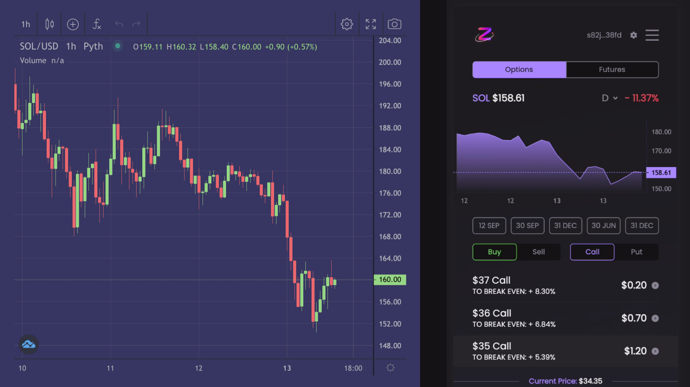

# Pyth History



Collects and aggregates trades from Pyth Network for display in a TradingView chart.
This is powering the charts on [trade.zeta.markets](https://trade.zeta.markets).
Feel free to improve and extend for the benefit for the larger Solana ecosystem.

**Note: This does not include a functioning trading view to inspect the
data.**

Check the [mango markets gui code](https://github.com/blockworks-foundation/mango-ui-v2/blob/main/components/TradingView/index.tsx) for a reference how to use this API to display a TradingView.

## Configuration

* `pricefeeds`: should be added to the dictionaries in src/index.ts

* All other configuration should be handled via environment variables.
  So far the following variables exist:

```
REDISCLOUD_URL: redis connection url
REDIS_MAX_CONN: maximum number of concurrent connections used by the redis pool
RPC_ENDPOINT_URL: solana rpc connection url
INTERVAL: time in seconds to wait between event queue polls
```
You can set these via a `.env` file in the root directory.

### Redis Setup

For the sake of optimisations in data fetching and aggregation, I've used the [Redis Timeseries module](https://github.com/RedisTimeSeries/RedisTimeSeries/). Therefore when setting up your Redis DB, you must add the Timeseries module for it to work.

## Credits

Many thanks to the Mango Markets team ([mango.markets](https://mango.markets)) whose original repo [Serum History](https://github.com/blockworks-foundation/serum-history) served as the foundation for this code.

## Questions / Suggestions?

👋 Reach out to the respective teams on Discord:
* [Zeta](https://discord.gg/vBe6gkgBV4)
* [Mango](https://discord.gg/cbDHKCnGJU)
* [Pyth](http://discord.gg/Ff2XDydUhu)
